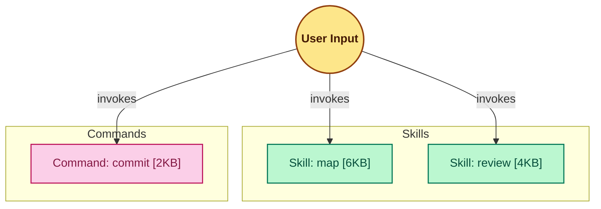

# Example: Small Environment (Happy Path)

> This example shows the map skill output for a user with 2 skills and 1 command installed. No collisions are present.

## Input

**Environment scanned:**
- `~/.claude/plugins/cache/claude-architecture-mapper/skills/map/SKILL.md` → skill `map`
- `~/.claude/plugins/cache/claude-code-auditor/skills/review/SKILL.md` → skill `review`
- `~/.claude/commands/commit.md` → command `/commit`

## Expected Output

### Ecosystem Inventory

| Name | Type | Source Plugin | Trigger | Model | Size | Governance |
| :--- | :--- | :--- | :--- | :--- | :--- | :--- |
| map | Skill | claude-architecture-mapper | — | — | 6 KB | 🔒 no-invoke |
| review | Skill | claude-code-auditor | — | — | 4 KB | 🔒 no-invoke |
| commit | Command | global | /commit | — | 2 KB | — |

### Collision Report

None detected. (No shared triggers; descriptions share fewer than 3 core action verbs.)

### Scale Rule Applied

≤ 15 nodes → `graph TD`. All three components rendered under their respective subgraphs.

### Mermaid Graph



### Completion Message

```
ARCHITECTURE.md updated — 3 components mapped, 0 collisions detected.
```
