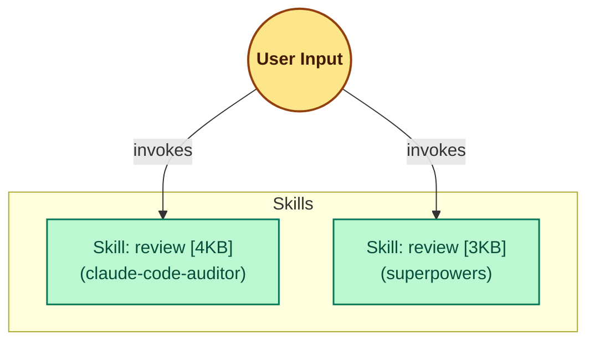

# Example: Trigger Collision Detected

> This example shows the map skill output when two installed components share the same slash command trigger — a Critical severity collision.

## Input

**Environment scanned:**
- `~/.claude/plugins/cache/claude-code-auditor/skills/review/SKILL.md` → skill `review`, trigger `/review`
- `~/.claude/plugins/cache/superpowers/skills/review/SKILL.md` → skill `review`, trigger `/review`

Both components declare `/review` as their invocation trigger.

## Expected Output

### Collision Report

| Component A | Component B | Reason | Severity |
| :--- | :--- | :--- | :--- |
| review (claude-code-auditor) | review (superpowers) | Same trigger `/review` | 🔴 Critical |

### Ecosystem Health

| Metric | Value | Status |
| :--- | :--- | :--- |
| Total Components | 2 | — |
| Installed Plugins | 2 | — |
| Collision Count | 1 | 🔴 |
| Bloat Alerts (>8KB) | 0 | 🟢 |

### Recommendation Generated

1. Rename one component's trigger to eliminate the conflict — e.g., use `/audit` for `claude-code-auditor:review` and keep `/review` for `superpowers:review`.

### Mermaid Graph

The graph is always produced even when collisions are present. Colliding nodes are rendered normally — the collision is reported in the table above, not in the graph itself.



### Completion Message

```text
ARCHITECTURE.md updated — 2 components mapped, 1 collision detected.
```
