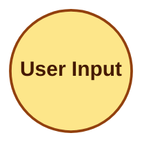

# Example: No Artifacts Found (Edge Case)

> This example shows what the map skill writes when the scan returns zero results — e.g., a fresh Claude Code install with no plugins.

## Input

**Environment scanned:**
- `~/.claude/` directory exists but contains no agent, skill, or command files
- Current project directory contains no Claude Code artifacts

All glob patterns return empty results.

## Expected Output

### Ecosystem Inventory

None detected.

### Collision Report

None detected.

### Ecosystem Health

| Metric | Value | Status |
| :--- | :--- | :--- |
| Total Components | 0 | — |
| Installed Plugins | 0 | — |
| Collision Count | 0 | 🟢 |
| Bloat Alerts (>8KB) | 0 | 🟢 |

### Recommendations

1. Install your first plugin: `/plugin marketplace add <repo-url>` then `/plugin install <name>@<marketplace>`.

### Mermaid Graph (minimal)



### Completion Message

```
ARCHITECTURE.md updated — 0 components mapped, 0 collisions detected.
```
