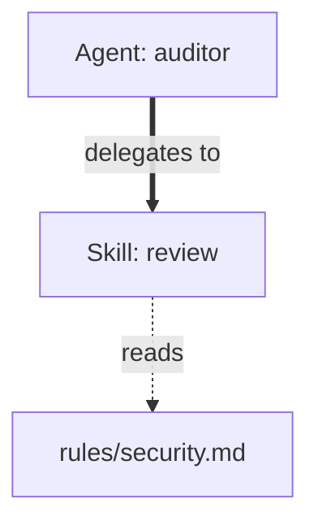

# Plugin Doctor Diagnostic Rules

> Apply these thresholds when evaluating Ecosystem Health and generating Recommendations in ARCHITECTURE.md. Each rule defines a condition, a detection method, and a required output action.

## 1. Instruction Bloat

| Threshold | Condition | Status | Action |
| :--- | :--- | :--- | :--- |
| Warning | File size > 8 KB | 🟡 | Alert in ARCHITECTURE.md; suggest splitting the file into skill + context reference |
| Critical | File size > 15 KB | 🔴 | Alert in ARCHITECTURE.md; strongly recommend extracting logic into a dedicated agent |

## 2. Activation Ambiguity (Semantic Collision)

- **Detection**: Keyword similarity > 70% between two components' `description:` fields.

**Output action**: Flag both components in the Collision Report with severity `🟡 Warning`. Suggest assigning unique slash commands to disambiguate.

## 3. Semantic Competition and Redundancy

- **Detection**: Behavioral trigger or description similarity > 80% between two components.
- **Winner selection**: Score each candidate on the three criteria below and choose the higher-scoring component as the preferred one.

| Criterion | Preferred if... |
| :--- | :--- |
| Clarity | Higher instruction-to-token ratio (more specific verbs, fewer filler words) |
| Stability | More explicit constraints, error handling, and exit conditions |
| Scope | Broader range of high-quality tools within a single domain |

- **Output action**: In Recommendations, write: "Merge [loser name] into [winner name] — [winner name] scores higher on [criterion]." List the specific features to absorb.

## 4. Connectivity and Dependency Analysis

- **Orphan**: A node with 0 incoming and 0 outgoing edges.
  - **Output action**: List in Recommendations as "Orphaned component — consider connecting or removing: [name]."
- **Bottleneck**: A node with > 5 outgoing edges.
  - **Output action**: Note in Recommendations: "Bottleneck detected at [name] — consider splitting into focused sub-skills."
- **Visual noise**: A node with > 3 incoming context (dotted) edges.
  - **Output action**: In the Mermaid graph, fold those context nodes into a single `ctx_cluster["Context Group"]` node rather than rendering each individually.
- **Critical path**: Identify the shortest chain from the `User` node to the terminal write/output node. Label this path in Recommendations as the primary execution flow.

## 5. Visual Hierarchy Rules

Apply these edge styles consistently:

| Relationship | Edge syntax | When to use |
| :--- | :--- | :--- |
| Delegation | `==>` (bold arrow) | Agent → Skill calls |
| Context/Rules reference | `-.->` (dotted arrow) | Skill → Rules/Context reads |
| Circular dependency | Red highlight + note | Only when on the Critical Path |

**Example showing all three edge types:**

> Note: `==>|"delegates to"|` uses Mermaid bold-arrow syntax with a double-quoted label per mermaid-rules.md Rule 3.
