# Mermaid Syntax Formatting Rules

> Apply all rules below unconditionally when generating Mermaid graphs for the Claude Architecture Mapper. Mermaid syntax is fragile — any violation causes the graph to fail rendering silently.

## 1. Safe Node IDs (CRITICAL)

- **Format**: Use a short prefix followed by a sanitized string: `c_` (command), `a_` (agent), `s_` (skill), `ctx_` (context), `mem_` (memory), `h_` (hook).
- **Sanitization**: Remove **ALL** non-alphanumeric characters. No dots, slashes, dashes, or spaces. Max 20 chars total.
- **BAD**: `agent_auditor.md`, `skill/review/SKILL.md`, `Command /audit`
- **GOOD**: `a_auditor`, `s_review`, `c_audit`, `h_pretooluse`

## 2. Reactive Edges (Hooks)

- For **Hooks** (automated events), use dotted lines `--. "description" .->` to distinguish from manual/proactive triggers.

## 3. Mandatory Label Quoting (CRITICAL)

- **Rule**: **EVERY** node label and edge label **MUST** be wrapped in double quotes, regardless of whether it contains special characters.
- **BAD**: `node1[Command: audit]`
- **GOOD**: `node1["Command: audit"]`
- **BAD**: `A -->|invokes| B`
- **GOOD**: `A -->|"invokes"| B`

## 4. Special Character Escaping

- If a label contains a literal double quote, escape it with `#quot;` or use a single quote inside.
- For slashes, backslashes, and colons in labels, double quoting is sufficient.
- **GOOD**: `node1["File: .claude/rules/lint.md"]`

## 5. Layout Direction

- Default to `graph TD` (top-down). The map skill's **scale rules override this** — use `graph LR` when node count exceeds 15. Scale rules take priority over this default.
- **BAD**: Starting with `graph LR` for a 10-node graph (scale rule says TD)
- **GOOD**: Starting with `graph TD` for ≤ 15 nodes; switching to `graph LR` only when > 15

## 6. Styling Classes (Required)

Declare all classes at the top of every graph. Apply using `:::className`. **NEVER** name a class `style` or `class`.

The palette uses **semantic color-wheel mapping**: hues are spaced ≥ 30° apart so every node type is instantly distinguishable. Fills use Tailwind 200-level (light, readable background). Strokes use Tailwind 700–900-level (dark, crisp border). The `color` property is always explicit for WCAG AA text contrast. `stroke-width` encodes visual hierarchy — heavier borders for active layers, lighter for passive.

```mermaid
graph TD
    classDef user    fill:#FDE68A,stroke:#92400E,color:#451A03,stroke-width:2px,font-weight:bold;
    classDef agent   fill:#BFDBFE,stroke:#1D4ED8,color:#1E3A8A,stroke-width:1.5px;
    classDef skill   fill:#BBF7D0,stroke:#047857,color:#064E3B,stroke-width:1.5px;
    classDef command fill:#FBCFE8,stroke:#BE185D,color:#831843,stroke-width:1.5px;
    classDef context fill:#DDD6FE,stroke:#6D28D9,color:#3B0764,stroke-width:1px;
    classDef memory  fill:#A5F3FC,stroke:#0E7490,color:#083344,stroke-width:1px;
    classDef misc    fill:#E5E7EB,stroke:#4B5563,color:#111827,stroke-width:1px;

    User((User Input)):::user
```

**Semantic mapping — do not reassign hues:**

| Class | Hue | Role | Reasoning |
| :--- | :--- | :--- | :--- |
| `user` | Amber 45° | Entry point | Warm gold = origin of all interactions |
| `agent` | Blue 220° | Orchestration | Cool blue = intelligence and delegation |
| `skill` | Emerald 160° | Execution | Green = productive action layer |
| `command` | Rose 340° | User triggers | Pink/rose = distinct from auto-invoked skills |
| `context` | Violet 270° | Reference | Purple = passive knowledge and rules |
| `memory` | Cyan 190° | State/storage | Cyan = cool persistence, distinct from agent blue |
| `misc` | Slate neutral | Automation/hooks | Gray = background processes |

## 7. Subgraphs

- Group by: `Commands`, `Agents`, `Skills`, `Context & Rules`, `Memory & State`.
- **Omit** subgraphs that have zero nodes. Empty subgraphs break the parser.
- Subgraph names: plain words only — no colons, slashes, emoji, or special characters.

## 8. Forbidden IDs

- Avoid using reserved keywords as node IDs: `graph`, `subgraph`, `end`, `class`, `style`, `click`, `callback`. Append an underscore if needed (e.g., `end_node`).

## 9. Label Length

- Truncate node labels at 35 characters. Use `\n` for line breaks only inside double-quoted labels.
- **BAD**: `s_myskill["Skill: my-very-long-skill-name-that-exceeds-the-limit"]`
- **GOOD**: `s_myskill["Skill: my-very-long-skill-na…"]`
